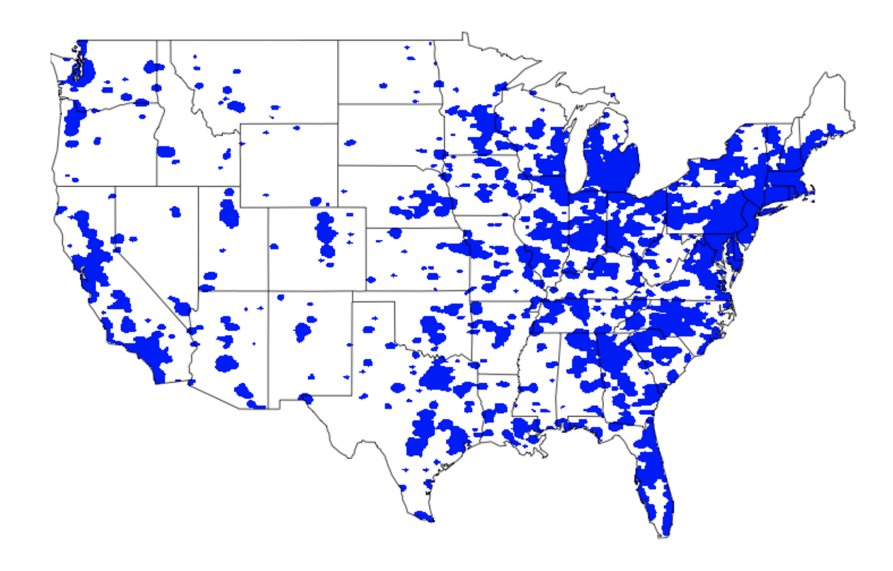

```{r setup, include=FALSE}
knitr::opts_chunk$set(echo = F, message = F, warning = F, results = 'hide', 
                      fig.height = 8, fig.width=10, fig.retina = 3)

het.cut = .25
sig.cutoff = .05
```

```{r environment, results='hide', message = F, warning = F}
packages = c("tidyverse", "knitr", "kableExtra", "papaja", "here", "choroplethr", "choroplethrMaps", "caret")
lapply(packages, library, character.only = TRUE)
rm(packages)

source(here("scripts/personality_scales.R"))
load(here("../../data/SAPA/collaboration/SAPAdata07feb2017thru22jul2019forSara2.rdata"))
load(here("data/logistic_output.Rdata"))
load(here("data/cleaned.Rdata"))

all_names = gsub("Extra", "B5: Extra", all_names)
all_names = gsub("Agree", "B5: Agree", all_names)
all_names = gsub("Neur", "B5: Neur", all_names)
all_names = gsub("Open", "B5: Open", all_names)
all_names = gsub("Consc", "B5: Consc", all_names)

```

class: inverse


---

class: inverse


---

class: inverse


---

```{r}
cdc = read_csv(here("data/cdc_norms.csv"))
colors = RColorBrewer::brewer.pal(2, "Set2")

norms = cdc %>%
  mutate(age = age/12) %>%
  filter(age > 11) %>%
  mutate(age = floor(age)) %>%
  group_by(age, gender) %>%
  filter(row_number() == 1)

df = data.frame(x = seq(11, 34, by = 1))

plot_boy_11 = df %>%
ggplot(aes(x)) +
  stat_function(fun = function(x) dnorm(x, mean = norms$mean[1], sd = norms$sd[1]),
                geom = "area", fill = colors[1], alpha = .5) +
  scale_x_continuous("BMI") +
  scale_y_continuous("density") +
  ggtitle("Boys Age 11")

plot_boy_13 = df %>%
ggplot(aes(x)) +
  stat_function(fun = function(x) dnorm(x, mean = norms$mean[3], sd = norms$sd[3]),
                geom = "area", fill = colors[1], alpha = .5) +
  scale_x_continuous("BMI") +
  scale_y_continuous("density")+
  ggtitle("Boys Age 13")

plot_boy_15 = df %>%
ggplot(aes(x)) +
  stat_function(fun = function(x) dnorm(x, mean = norms$mean[5], sd = norms$sd[5]),
                geom = "area", fill = colors[1], alpha = .5) +
  scale_x_continuous("BMI") +
  scale_y_continuous("density")+
  ggtitle("Boys Age 15")

plot_boy_17 = df %>%
ggplot(aes(x)) +
  stat_function(fun = function(x) dnorm(x, mean = norms$mean[7], sd = norms$sd[7]),
                geom = "area", fill = colors[1], alpha = .5) +
  scale_x_continuous("BMI") +
  scale_y_continuous("density")+
  ggtitle("Boys Age 17")

plot_boy_19 = df %>%
ggplot(aes(x)) +
  stat_function(fun = function(x) dnorm(x, mean = norms$mean[9], sd = norms$sd[9]),
                geom = "area", fill = colors[1], alpha = .5) +
  scale_x_continuous("BMI") +
  scale_y_continuous("density")+
  ggtitle("Boys Age 19")

plot_girl_11 = df %>%
ggplot(aes(x)) +
  stat_function(fun = function(x) dnorm(x, mean = norms$mean[11], sd = norms$sd[11]),
                geom = "area", fill = colors[2], alpha = .5) +
  scale_x_continuous("BMI") +
  scale_y_continuous("density")+
  ggtitle("Girls Age 11")

plot_girl_13 = df %>%
ggplot(aes(x)) +
  stat_function(fun = function(x) dnorm(x, mean = norms$mean[13], sd = norms$sd[13]),
                geom = "area", fill = colors[2], alpha = .5) +
  scale_x_continuous("BMI") +
  scale_y_continuous("density")+
  ggtitle("Girls Age 13")

plot_girl_15 = df %>%
ggplot(aes(x)) +
  stat_function(fun = function(x) dnorm(x, mean = norms$mean[15], sd = norms$sd[15]),
                geom = "area", fill = colors[2], alpha = .5) +
  scale_x_continuous("BMI") +
  scale_y_continuous("density")+
  ggtitle("Girls Age 15")

plot_girl_17 = df %>%
ggplot(aes(x)) +
  stat_function(fun = function(x) dnorm(x, mean = norms$mean[17], sd = norms$sd[17]),
                geom = "area", fill = colors[2], alpha = .5) +
  scale_x_continuous("BMI") +
  scale_y_continuous("density")+
  ggtitle("Girls Age 17")

plot_girl_19 = df %>%
ggplot(aes(x)) +
  stat_function(fun = function(x) dnorm(x, mean = norms$mean[19], sd = norms$sd[19]),
                geom = "area", fill = colors[2], alpha = .5) +
  scale_x_continuous("BMI") +
  scale_y_continuous("density")+
  ggtitle("Girls Age 19")

ggpubr::ggarrange(plot_boy_11, plot_girl_11,
                  plot_boy_13, plot_girl_13,
                  plot_boy_15, plot_girl_15,
                  plot_boy_17, plot_girl_17,
                  plot_boy_19, plot_girl_19,
                  ncol = 2, nrow = 5)
```


---

```{r}
bcolors = RColorBrewer::brewer.pal(n = 4, "GnBu")
gcolors = RColorBrewer::brewer.pal(n = 4, "RdPu")
norms = norms %>%
  mutate(underweight = map2_dbl(mean, sd, function(x,y) qnorm(p = .05, mean = x, sd = y)),
         normal = map2_dbl(mean, sd, function(x,y) qnorm(p = .85, mean = x, sd = y)),
         overweight = map2_dbl(mean, sd, function(x,y) qnorm(p = .95, mean = x, sd = y)))

df = data.frame(x = seq(11, 34, by = 1))

plot_boy_11 = df %>%
ggplot(aes(x)) +
    stat_function(fun = function(x) dnorm(x, mean = norms$mean[1], sd = norms$sd[1]),
                geom = "area", fill = bcolors[4], alpha = .9, xlim = c(min(df$x), norms$underweight[1])) +
  stat_function(fun = function(x) dnorm(x, mean = norms$mean[1], sd = norms$sd[1]),
                geom = "area", fill = bcolors[2], alpha = .9, xlim = c(norms$underweight[1], norms$normal[1])) +
  stat_function(fun = function(x) dnorm(x, mean = norms$mean[1], sd = norms$sd[1]),
                geom = "area", fill = bcolors[3], alpha = .9, xlim = c(norms$normal[1], norms$overweight[1])) +
  stat_function(fun = function(x) dnorm(x, mean = norms$mean[1], sd = norms$sd[1]),
                geom = "area", fill = bcolors[4], alpha = .9, xlim = c(norms$overweight[1], max(df$x))) +
  scale_x_continuous("BMI") +
  scale_y_continuous("density") +
  ggtitle("Boys Age 11")

plot_boy_13 = df %>%
ggplot(aes(x)) +
  stat_function(fun = function(x) dnorm(x, mean = norms$mean[3], sd = norms$sd[3]),
                geom = "area", fill = bcolors[4], alpha = .9, xlim = c(min(df$x), norms$underweight[3])) +
  stat_function(fun = function(x) dnorm(x, mean = norms$mean[3], sd = norms$sd[3]),
                geom = "area", fill = bcolors[2], alpha = .9, xlim = c(norms$underweight[3], norms$normal[3])) +
  stat_function(fun = function(x) dnorm(x, mean = norms$mean[3], sd = norms$sd[3]),
                geom = "area", fill = bcolors[3], alpha = .9, xlim = c(norms$normal[3], norms$overweight[3])) +
  stat_function(fun = function(x) dnorm(x, mean = norms$mean[3], sd = norms$sd[3]),
                geom = "area", fill = bcolors[4], alpha = .9, xlim = c(norms$overweight[3], max(df$x))) +
  scale_x_continuous("BMI") +
  scale_y_continuous("density")+
  ggtitle("Boys Age 13")

plot_boy_15 = df %>%
ggplot(aes(x)) +
  stat_function(fun = function(x) dnorm(x, mean = norms$mean[5], sd = norms$sd[5]),
                geom = "area", fill = bcolors[4], alpha = .9, xlim = c(min(df$x), norms$underweight[5])) +
  stat_function(fun = function(x) dnorm(x, mean = norms$mean[5], sd = norms$sd[5]),
                geom = "area", fill = bcolors[2], alpha = .9, xlim = c(norms$underweight[5], norms$normal[5])) +
  stat_function(fun = function(x) dnorm(x, mean = norms$mean[5], sd = norms$sd[5]),
                geom = "area", fill = bcolors[3], alpha = .9, xlim = c(norms$normal[5], norms$overweight[5])) +
  stat_function(fun = function(x) dnorm(x, mean = norms$mean[5], sd = norms$sd[5]),
                geom = "area", fill = bcolors[4], alpha = .9, xlim = c(norms$overweight[5], max(df$x))) +
  scale_x_continuous("BMI") +
  scale_y_continuous("density")+
  ggtitle("Boys Age 15")

plot_boy_17 = df %>%
ggplot(aes(x)) +
    stat_function(fun = function(x) dnorm(x, mean = norms$mean[7], sd = norms$sd[7]),
                geom = "area", fill = bcolors[4], alpha = .9, xlim = c(min(df$x), norms$underweight[7])) +
  stat_function(fun = function(x) dnorm(x, mean = norms$mean[7], sd = norms$sd[7]),
                geom = "area", fill = bcolors[2], alpha = .9, xlim = c(norms$underweight[7], norms$normal[7])) +
  stat_function(fun = function(x) dnorm(x, mean = norms$mean[7], sd = norms$sd[7]),
                geom = "area", fill = bcolors[3], alpha = .9, xlim = c(norms$normal[7], norms$overweight[7])) +
  stat_function(fun = function(x) dnorm(x, mean = norms$mean[7], sd = norms$sd[7]),
                geom = "area", fill = bcolors[4], alpha = .9, xlim = c(norms$overweight[7], max(df$x))) +
  scale_x_continuous("BMI") +
  scale_y_continuous("density")+
  ggtitle("Boys Age 17")

plot_boy_19 = df %>%
ggplot(aes(x)) +
  stat_function(fun = function(x) dnorm(x, mean = norms$mean[9], sd = norms$sd[9]),
                geom = "area", fill = bcolors[4], alpha = .9, xlim = c(min(df$x), norms$underweight[9])) +
  stat_function(fun = function(x) dnorm(x, mean = norms$mean[9], sd = norms$sd[9]),
                geom = "area", fill = bcolors[2], alpha = .9, xlim = c(norms$underweight[9], norms$normal[9])) +
  stat_function(fun = function(x) dnorm(x, mean = norms$mean[9], sd = norms$sd[9]),
                geom = "area", fill = bcolors[3], alpha = .9, xlim = c(norms$normal[9], norms$overweight[9])) +
  stat_function(fun = function(x) dnorm(x, mean = norms$mean[9], sd = norms$sd[9]),
                geom = "area", fill = bcolors[4], alpha = .9, xlim = c(norms$overweight[9], max(df$x))) +
  scale_x_continuous("BMI") +
  scale_y_continuous("density")+
  ggtitle("Boys Age 19")

plot_girl_11 = df %>%
ggplot(aes(x)) +
  stat_function(fun = function(x) dnorm(x, mean = norms$mean[11], sd = norms$sd[11]),
                geom = "area", fill = gcolors[4], alpha = .9, xlim = c(min(df$x), norms$underweight[11])) +
  stat_function(fun = function(x) dnorm(x, mean = norms$mean[11], sd = norms$sd[11]),
                geom = "area", fill = gcolors[2], alpha = .9, xlim = c(norms$underweight[11], norms$normal[11])) +
  stat_function(fun = function(x) dnorm(x, mean = norms$mean[11], sd = norms$sd[11]),
                geom = "area", fill = gcolors[3], alpha = .9, xlim = c(norms$normal[11], norms$overweight[11])) +
  stat_function(fun = function(x) dnorm(x, mean = norms$mean[11], sd = norms$sd[11]),
                geom = "area", fill = gcolors[4], alpha = .9, xlim = c(norms$overweight[11], max(df$x))) +
  scale_x_continuous("BMI") +
  scale_y_continuous("density")+
  ggtitle("Girls Age 11")

plot_girl_13 = df %>%
ggplot(aes(x)) +
  stat_function(fun = function(x) dnorm(x, mean = norms$mean[13], sd = norms$sd[13]),
                geom = "area", fill = gcolors[4], alpha = .9, xlim = c(min(df$x), norms$underweight[13])) +
  stat_function(fun = function(x) dnorm(x, mean = norms$mean[13], sd = norms$sd[13]),
                geom = "area", fill = gcolors[2], alpha = .9, xlim = c(norms$underweight[13], norms$normal[13])) +
  stat_function(fun = function(x) dnorm(x, mean = norms$mean[13], sd = norms$sd[13]),
                geom = "area", fill = gcolors[3], alpha = .9, xlim = c(norms$normal[13], norms$overweight[13])) +
  stat_function(fun = function(x) dnorm(x, mean = norms$mean[13], sd = norms$sd[13]),
                geom = "area", fill = gcolors[4], alpha = .9, xlim = c(norms$overweight[13], max(df$x))) +
  scale_x_continuous("BMI") +
  scale_y_continuous("density")+
  ggtitle("Girls Age 13")

plot_girl_15 = df %>%
ggplot(aes(x)) +
  stat_function(fun = function(x) dnorm(x, mean = norms$mean[15], sd = norms$sd[15]),
                geom = "area", fill = gcolors[4], alpha = .9, xlim = c(min(df$x), norms$underweight[15])) +
  stat_function(fun = function(x) dnorm(x, mean = norms$mean[15], sd = norms$sd[15]),
                geom = "area", fill = gcolors[2], alpha = .9, xlim = c(norms$underweight[15], norms$normal[15])) +
  stat_function(fun = function(x) dnorm(x, mean = norms$mean[15], sd = norms$sd[15]),
                geom = "area", fill = gcolors[3], alpha = .9, xlim = c(norms$normal[15], norms$overweight[15])) +
  stat_function(fun = function(x) dnorm(x, mean = norms$mean[15], sd = norms$sd[15]),
                geom = "area", fill = gcolors[4], alpha = .9, xlim = c(norms$overweight[15], max(df$x))) +
  scale_x_continuous("BMI") +
  scale_y_continuous("density")+
  ggtitle("Girls Age 15")

plot_girl_17 = df %>%
ggplot(aes(x)) +
  stat_function(fun = function(x) dnorm(x, mean = norms$mean[17], sd = norms$sd[17]),
                geom = "area", fill = gcolors[4], alpha = .9, xlim = c(min(df$x), norms$underweight[17])) +
  stat_function(fun = function(x) dnorm(x, mean = norms$mean[17], sd = norms$sd[17]),
                geom = "area", fill = gcolors[2], alpha = .9, xlim = c(norms$underweight[17], norms$normal[17])) +
  stat_function(fun = function(x) dnorm(x, mean = norms$mean[17], sd = norms$sd[17]),
                geom = "area", fill = gcolors[3], alpha = .9, xlim = c(norms$normal[17], norms$overweight[17])) +
  stat_function(fun = function(x) dnorm(x, mean = norms$mean[17], sd = norms$sd[17]),
                geom = "area", fill = gcolors[4], alpha = .9, xlim = c(norms$overweight[17], max(df$x))) +
  scale_x_continuous("BMI") +
  scale_y_continuous("density")+
  ggtitle("Girls Age 17")

plot_girl_19 = df %>%
ggplot(aes(x)) +
  stat_function(fun = function(x) dnorm(x, mean = norms$mean[19], sd = norms$sd[19]),
                geom = "area", fill = gcolors[4], alpha = .9, xlim = c(min(df$x), norms$underweight[19])) +
  stat_function(fun = function(x) dnorm(x, mean = norms$mean[19], sd = norms$sd[19]),
                geom = "area", fill = gcolors[2], alpha = .9, xlim = c(norms$underweight[19], norms$normal[19])) +
  stat_function(fun = function(x) dnorm(x, mean = norms$mean[19], sd = norms$sd[19]),
                geom = "area", fill = gcolors[3], alpha = .9, xlim = c(norms$normal[19], norms$overweight[19])) +
  stat_function(fun = function(x) dnorm(x, mean = norms$mean[19], sd = norms$sd[19]),
                geom = "area", fill = gcolors[4], alpha = .9, xlim = c(norms$overweight[19], max(df$x))) +
  scale_x_continuous("BMI") +
  scale_y_continuous("density")+
  ggtitle("Girls Age 19")

ggpubr::ggarrange(plot_boy_11, plot_girl_11,
                  plot_boy_13, plot_girl_13,
                  plot_boy_15, plot_girl_15,
                  plot_boy_17, plot_girl_17,
                  plot_boy_19, plot_girl_19,
                  ncol = 2, nrow = 5)
```

---

## sapa-project.org


---

.pull-left[
### SAPA


```{r sapa gender}
SAPAdata07feb2017thru22jul2019x %>%
  filter(sex %in% c("male", "female")) %>%
  mutate(sex = factor(sex, levels = c("female", "male"))) %>%
  ggplot(aes(x = age, fill = sex)) +
  geom_histogram(binwidth = 1) +
  scale_x_continuous(limits = c(0,100)) +
  theme_bw() + theme(text = element_text(size = 20))
```

]

.pull-right[

### US Census (2010)
```{r census pop}
data("df_pop_county")
county_choropleth(df_pop_county)
```

```{r census gender}
census = read_csv(here("presentation/extra_data/census_est.csv"), na = "999")
census %>%
  filter(SEX != 0) %>%
  rename(sex = SEX,
         age = AGE,
         count = POPESTIMATE2018) %>%
  mutate(sex = ifelse(sex == 1, "male", "female")) %>%
ggplot(aes(x = age, y = count, fill = sex)) +
  geom_bar(stat = "identity") +
  theme_bw() + theme(text = element_text(size = 20))

```

]

---

## Current sample

Data collected between February 7, 2017 and July 22, 2019 $(N = `r papaja::printnum(nrow(SAPAdata07feb2017thru22jul2019x), format = "d")`)$.

- Restricted to participants younger than 18 years old $(N =`r nrow(sapa)`$ , `r round(100*(table(sapa$sex)[1]/sum(table(sapa$sex))))` \% female).

Estimate parent's socioeconomic status by standardizing and averaging:
- number of years of education (for each parent)
- estimated parental occupational prestige (for each parent)
- estimated income (for each parent)


---


```{r girls het diagram, fig.height=10}
load(here("data/cor_output.Rdata"))
traits = which(grepl("SPI", rownames(R_female)))
R_female = R_female[traits,traits]

rownames(R_female) = colnames(R_female) = all_names[rownames(R_female)]

spi5 = which(grepl("B5", rownames(R_female)))
spi27 = which(!grepl("B5", rownames(R_female)))
new = rownames(psych::fa.sort(R_female[spi27, spi5]))

spi27 = sapply(new, function(x) which(rownames(R_female) == x))

psych::het.diagram(R_female,
                   levels = list(SPI5 = spi5, SPI27 = spi27),
                   cut=het.cut, digits=2, main = "Heterarchy diagram (girls)", cex=.9, l.cex = .7)
```

---

```{r boys hetdiagram, fig.height=10}
load(here("data/cor_output.Rdata"))
traits = which(grepl("SPI", rownames(R_male)))
R_male = R_male[traits,traits]

rownames(R_male) = colnames(R_male) = all_names[rownames(R_male)]

spi5 = which(grepl("B5", rownames(R_male)))
spi27 = which(!grepl("B5", rownames(R_male)))
new = rownames(psych::fa.sort(R_male[spi27, spi5]))

spi27 = sapply(new, function(x) which(rownames(R_male) == x))

psych::het.diagram(R_male,
                   levels = list(SPI5 = spi5, SPI27 = spi27),
                   cut=het.cut, digits=2, main = "Heterarchy diagram (boys)",
                   cex=.9, l.cex = .7)
```

---

### Methods

1. Parition dataset into training (75%) and test (25%) samples.

    - Separate partitioning and analysis by gender

2. Multinomial logistic regression 33 times

     - Once for each trait (Big 5, SPI 27, Cognitive ability)

     - $BMI \sim \beta_0 + \beta_1(\text{trait score}) + \beta_2(\text{Socioeconomic status})$

     - 10-fold cross-validation, 10 times

     - Coefficient estimates are from final, averaged model in training set

---

```{r prep data}
female_log_reg = female_log %>%
  mutate(coef = map(final_mod, broom::tidy, conf.int = TRUE)) %>%
  dplyr::select(trait_name, model, coef) %>%
  unnest() %>%
  mutate(gender = "girls")

male_log_reg = male_log %>%
  mutate(coef = map(final_mod, broom::tidy, conf.int = TRUE)) %>%
  dplyr::select(trait_name, model, coef) %>%
  unnest() %>%
  mutate(gender = "boys")
```


```{r girls sig models, results = 'asis'}
female_log_reg %>%
  filter(p.value < sig.cutoff) %>%
  filter(model == "cov") %>%
  filter(term == "trait_score") %>%
  mutate(direction = ifelse(estimate < 1, "neg", "pos"),
         direction = factor(direction, levels = c("pos", "neg"))) %>%
  mutate(trait_name = all_names[trait_name]) %>%
  mutate(estimate = estimate-1) %>%
  arrange(-estimate) %>%
  ggplot(aes(x = reorder(trait_name, estimate), y = estimate, fill = direction)) +
  geom_bar(stat = "identity") +
  scale_x_discrete("")+
  scale_y_continuous(breaks = seq(-.3,.4,.1), labels = seq(.7,1.4,.1)) +
  ylab("Estimate of OR of Personality") +
  coord_flip() +
  ggtitle("Personality associates of BMI cateogory \ncontrolling for SES (girls age 13-17)") +
  facet_grid(.~y.level) +
  guides(fill = F) +
  theme_bw() +
  theme(text = element_text(size = 18), axis.text.x = element_text(size = 8))
```

---

class: center

```{r boys sig models, results = 'asis'}
male_log_reg %>%
  filter(p.value < sig.cutoff) %>%
  filter(model == "cov") %>%
  filter(term == "trait_score") %>%
  mutate(direction = ifelse(estimate < 1, "neg", "pos"),
         direction = factor(direction, levels = c("pos", "neg"))) %>%
  mutate(trait_name = all_names[trait_name]) %>%
  mutate(estimate = estimate-1) %>%
  arrange(-estimate) %>%
  ggplot(aes(x = reorder(trait_name, estimate), y = estimate, fill = direction)) +
  geom_bar(stat = "identity") +
  scale_x_discrete("")+
  scale_y_continuous(breaks = seq(-.3,.4,.1), labels = seq(.7,1.4,.1)) +
  ylab("Estimate of OR of Personality") +
  coord_flip() +
  ggtitle("Personality associates of BMI cateogory \ncontrolling for SES (boys age 13-17)") +
  facet_grid(.~y.level) +
  guides(fill = F) +
  theme_bw() +
  theme(text = element_text(size = 18), axis.text.x = element_text(size = 8))
```

---

class: center
```{r boys sig models with female, results = 'asis'}

female_results = female_log_reg %>%
  filter(p.value < sig.cutoff) %>%
  filter(model == "cov") %>%
  filter(term == "trait_score") %>%
  mutate(direction = ifelse(estimate < 1, "neg", "pos"),
         direction = factor(direction, levels = c("pos", "neg"))) %>%
  select(trait_name, y.level, direction) %>%
  rename(female_direction = direction)

male_log_reg %>%
  filter(p.value < sig.cutoff) %>%
  filter(model == "cov") %>%
  filter(term == "trait_score") %>%
  mutate(direction = ifelse(estimate < 1, "neg", "pos"),
         direction = factor(direction, levels = c("pos", "neg"))) %>%
  left_join(female_results) %>%
  mutate(same = ifelse(direction == female_direction, "*", "")) %>%
  mutate(trait_name = all_names[trait_name]) %>%
  mutate(estimate = estimate-1) %>%
  arrange(-estimate) %>%
  ggplot(aes(x = reorder(trait_name, estimate), y = estimate, fill = direction)) +
  geom_bar(stat = "identity") +
  geom_text(aes(label = same), size = 15) +
  scale_x_discrete("")+
  scale_y_continuous(breaks = seq(-.3,.4,.1), labels = seq(.7,1.4,.1)) +
  ylab("Estimate of OR of Personality") +
  coord_flip() +
  ggtitle("Personality associates of BMI cateogory \n controlling for SES (boys age 13-17)") +
  facet_grid(.~y.level) +
  guides(fill = F) +
  theme_bw() +
  theme(text = element_text(size = 18), axis.text.x = element_text(size = 8))
```
---

### Methods

3. Multinomial logistic regression 2 times

     - $BMI \sim \beta_0 + \beta_1(\text{Socioeconomic status}) + \beta2(\text{Extraversion}) \\+ \beta_3(\text{Agreeableness}) + \beta_4(\text{Conscientiousness}) \\+ \beta_5(\text{Neuroticism})+ \beta_6(\text{Openness})$

     - $BMI \sim \beta_0 + \beta_1(\text{Socioeconomic status}) + \beta_2(\text{Compassion}) \\+ \beta_3(\text{Irritabilty})+ \beta_4(\text{Well Being}) \\+ \dots + \beta_28(\text{Conservatism})$

Examine variable importance in the training set.

Compare accuracy of prediction in test set.

---

```{r}
load(here("data/multitrait.Rdata"))
all_names[34] = "Socioeconomic\nStatus"
names(all_names)[34] = "ses"
all_names = gsub(" ", "\n", all_names)

imp_27_female = imp_27_female$importance %>%
  mutate(gender = "girls",
         trait = rownames(.))
imp_27_female$trait = all_names[imp_27_female$trait]

imp_27_male = imp_27_male$importance %>%
  mutate(gender = "boys",
         trait = rownames(.))
imp_27_male$trait = all_names[imp_27_male$trait]

p_female = imp_27_female %>%
  arrange(desc(Overall)) %>%
  filter(row_number() < 11) %>%
  ggplot(aes(x = reorder(trait, Overall), y = Overall)) +
  geom_point(size = 2) +
  geom_segment(aes(xend = trait, yend = 0))+
  scale_x_discrete("")+
  scale_y_continuous("Importance", limits = c(0,1.25))+
  coord_flip()+
  ggtitle("Girls") +
  theme_bw(base_size = 20)

p_male = imp_27_male %>%
  arrange(desc(Overall)) %>%
  filter(row_number() < 11) %>%
  ggplot(aes(x = reorder(trait, Overall), y = Overall)) +
  geom_point(size = 2) +
  geom_segment(aes(xend = trait, yend = 0))+
  scale_x_discrete("")+
  scale_y_continuous("Importance", limits = c(0,1.25))+
  coord_flip()+
  ggtitle("Boys") +
  theme_bw(base_size = 20)

ggpubr::ggarrange(p_female, p_male)
```

---


```{r}
all_names = gsub("B5:\\n", "", all_names)

imp_5_female = imp_5_female$importance %>%
  mutate(gender = "girls",
         trait = rownames(.))
imp_5_female$trait = all_names[imp_5_female$trait]

imp_5_male = imp_5_male$importance %>%
  mutate(gender = "boys",
         trait = rownames(.))
imp_5_male$trait = all_names[imp_5_male$trait]

p_female2 = imp_5_female %>%
  arrange(desc(Overall)) %>%
  ggplot(aes(x = reorder(trait, Overall), y = Overall)) +
  geom_point(size = 2) +
  geom_segment(aes(xend = trait, yend = 0))+
  scale_x_discrete("")+
  scale_y_continuous("Importance", limits = c(0,1.25))+
  coord_flip()+
  ggtitle("Girls") +
  theme_bw(base_size = 20)

p_male2 = imp_5_male %>%
  arrange(desc(Overall)) %>%
  ggplot(aes(x = reorder(trait, Overall), y = Overall)) +
  geom_point(size = 2) +
  geom_segment(aes(xend = trait, yend = 0))+
  scale_x_discrete("")+
  scale_y_continuous("Importance", limits = c(0,1.25))+
  coord_flip()+
  ggtitle("Boys") +
  theme_bw(base_size = 20)

ggpubr::ggarrange(p_female2, p_male2)
```

---

```{r}
acc.df = data.frame(expand.grid(gender = c("girls", "boys"),
                                model = c("27 Factors", "Big 5")))
acc.df$output = list(accuracy_27_female, accuracy_27_male, accuracy_b5_female, accuracy_b5_male)

acc.df = acc.df %>%
  mutate(overall = map(output, "overall"),
         accuracy = map_dbl(overall, "Accuracy"),
         lower = map_dbl(overall, "AccuracyLower"),
         upper = map_dbl(overall, "AccuracyUpper"))

acc.df %>%
  ggplot(aes(x = model, y = accuracy, fill = gender)) +
  geom_bar(stat = "identity", position = "dodge") +
  geom_errorbar(aes(ymin = lower, ymax=upper), position = position_dodge(.9), width = .5) +
  theme_bw(base_size = 20)
```

---

### Wrap-up

Personality traits are associated with weight category above and beyond socio-economic status.

    - Some personality traits are more strongly associated with weight than SES.

As a group, narrow traits (SPI 27) have a stronger association with weight category than broad traits (Big 5).

Cautionary note: these are association, and causal relationships are most likely bidirectional, even within a trait.

---

class: inverse

### Thank you

.pull-left[


### David Condon
]

.pull-right[


### Magdalena Leszko
]


---

class: center

```{r non-interaction models SES 1}
female_log_reg %>%
  full_join(male_log_reg) %>%
  filter(model == "cov" & term == "ses") %>%
  ggplot(aes(x = estimate, fill = y.level)) +
  geom_vline(aes(xintercept = 1), color = "black")+
  geom_density(alpha = .3, color = "white")+
  geom_histogram(bins = 40, aes(y = ..density..), color = "white", position = "dodge") +
  facet_grid(gender ~.) +
  xlab(expression(paste("Estimate of OR of SES"))) +
  #scale_x_reverse(breaks = seq(-.2, -.05, .01)) +
  geom_hline(aes(yintercept = 0), color = "gray")+
  scale_fill_discrete("Odds of X compared to Normal")+
  theme_bw()+
  theme(text = element_text(size = 20), legend.position = "top") +
  ggtitle("Effect of SES on BMI (controlling for personality or cognition)")
```

---

class: center

## Current sample

```{r, results = 'asis'}
table(sapa$sex, sapa$BMI_c) %>%
  kable() %>%
  kable_styling()
```
